# Agent Auditor

Audits Claude Code skills, agents, and components for compliance and effectiveness.

**Status**: v1.0-ready. The skill auditor is production-ready for immediate use.

## Overview

Validates Claude Code skills against official Anthropic specifications.
Ensures skills trigger reliably through auto-invocation.

## Structure

```text
agent-auditor/
├── docs/                    # Documentation
│   ├── research/            # Research and analysis
│   └── guides/              # User guides
├── src/                     # Source code
│   ├── skill_auditor/       # Python SDK
│   └── tests/              # Test suite
├── agents/                  # Claude Code agent definitions
├── commands/                # Claude Code command definitions
└── MIGRATION.md            # Migration checklist
```

## What's Included

### Research & Documentation

- Architecture decisions and design rationale
- Problem analysis and root cause investigations
- Implementation documentation and plans
- Testing results and validation reports
- Agent evolution history
- Development notes and observations

### Source Code

- Python SDK for deterministic skill auditing
- Metrics extraction and validation logic
- Test suite with comprehensive coverage
- CLI application

### Agent Definitions

- Skill-auditor agents (v3-v6)
- Progression from non-deterministic to deterministic approaches

### Commands

- Commands for skill validation and auditing

## Quick Start

### Installation

```bash
# Install from source
uv pip install -e .
```

### Usage

Two modes available:

**Fast Mode (Default)** - Deterministic validation

```bash
# Using module
uv run python -m skill_auditor.cli /path/to/skill/directory

# Or using console script
skill-auditor /path/to/skill/directory
```

**Explain Mode** - AI-powered analysis and fix suggestions

```bash
# Add --explain flag
uv run python -m skill_auditor.cli /path/to/skill/directory --explain

# Or with console script
skill-auditor /path/to/skill/directory --explain
```

### Examples

**Fast Mode** (instant, free):

```bash
$ uv run python -m skill_auditor.cli .claude/skills/my-skill

🔍 Auditing skill: .claude/skills/my-skill
============================================================

📊 Extracting metrics...
✅ Extracted 14 metrics
   - Quoted phrases: 2
   - Domain indicators: 4
   - Line count: 450

📊 Running deterministic validation...

🔴 BLOCKED

❌ BLOCKERS:
  B4: Implementation details in description: ['script.py', 'docker']

⚠️  WARNINGS:
  W1: Only 2 quoted phrases (need 3+)

💡 TIP: Run with --explain for detailed fix suggestions
```

**Explain Mode** (~2-3s, ~$0.004):

```bash
$ uv run python -m skill_auditor.cli .claude/skills/my-skill --explain

🔍 Auditing skill: .claude/skills/my-skill
============================================================

📊 Extracting metrics...
✅ Extracted 14 metrics

🤖 Using Claude for detailed analysis...

# Skill Audit Report: my-skill

**Status:** 🔴 BLOCKED

[Detailed explanations and fix suggestions from Claude...]
```

## Key Concepts

- **Deterministic Auditing**: Python extracts metrics consistently across runs
- **Dual-Mode Operation**: Choose fast validation (default) or AI explanations (--explain)
- **Effectiveness Validation**: Checks both compliance and auto-invocation potential
- **Progressive Disclosure**: Validates skills follow correct information architecture

## Architecture

Two-tier validation:

```mermaid
flowchart TD
    A[SKILL.md] --> B[Python: Extract Metrics]
    B --> C{Deterministic<br/>Validation}
    C --> D[Calculate Checks<br/>B1-B4, W1, W3]
    D --> E{Mode?}

    E -->|Fast Mode<br/>default| F[Format Results]
    F --> G[Terminal Output<br/>✅ PASS / ❌ FAIL]

    E -->|--explain| H[Build Context]
    H --> I[Claude Analysis]
    I --> J[Semantic Evaluation]
    J --> K[Detailed Report<br/>+ Fix Suggestions]

    style C fill:#e1f5ff
    style D fill:#e1f5ff
    style F fill:#e1f5ff
    style I fill:#fff4e1
    style J fill:#fff4e1
    style G fill:#d4edda
    style K fill:#d4edda
```



**1. Deterministic Layer (Python)** - Always runs

- Extracts metrics: quoted phrases, domain indicators, line count
- Validates official requirements (B1-B4)
- Checks effectiveness criteria (W1, W3)
- Fast, free, reproducible

**2. Semantic Layer (Claude)** - Optional `--explain` flag

- Explains violations in context
- Suggests specific fixes
- Adds recommendations
- Costs ~$0.004 per audit, 2-3 seconds
